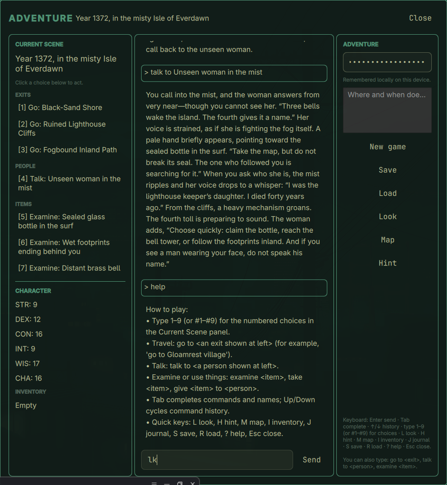

# Adventure for Omarchy

A keyboard-first, AI-powered text adventure for Omarchy. Begin in any place and time, explore a living world, talk with memorable characters, uncover clues, and shape the story through your choices.

Requires an OpenAI API key with API billing; a ChatGPT subscription alone does not provide API access.



## Exploration

Every new adventure opens in a broad named region with at least three meaningful routes. As you travel, the game reveals connected settlements, wilderness, landmarks, and other named locations; the map records routes you have discovered. Ordinary scenes keep at least two ways forward, while true endings and temporary defeats are the only intentional exceptions.

## What you need

- Omarchy 4.0 (Quattro) with Quickshell plugin support.
- Internet access and an OpenAI API key with API billing.

A ChatGPT subscription by itself does not include OpenAI API access or API billing.

## Install

Install from the Adventure repository:

```bash
omarchy plugin add https://github.com/kszx11/omarchy-plugin-adv.git --enable
```

Omarchy will warn that plugins run unsandboxed; install only repositories you trust. When prompted, choose where Adventure should appear in the bar. Click its icon to open the game.

You can also open Adventure from a terminal:

```bash
omarchy-shell shell summon io.github.kszx11.adventure '{}'
```

## Start playing

1. Open Adventure from its bar icon.
2. Enter your OpenAI API key in the right-hand panel.
3. Describe the place and time for your adventure, then select **New game**.
4. Use the numbered choices or type commands such as `look`, `go to <place>`, `talk to <person>`, or `examine <thing>`.

Your entered API key is remembered only on your device in an owner-only local directory. Adventure uses `OPENAI_API_KEY` automatically if the Omarchy shell was started with that environment variable. Your key and save data are never added to the plugin repository.

## Updating

```bash
omarchy plugin update io.github.kszx11.adventure
```

## Remove

```bash
omarchy plugin remove io.github.kszx11.adventure
```

Removing the plugin keeps your local API key and saved adventures. If you also want to erase them, delete the `~/.local/state/omarchy-adventure/` directory.
